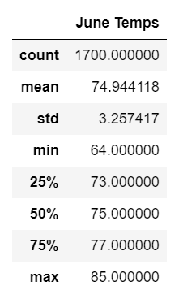
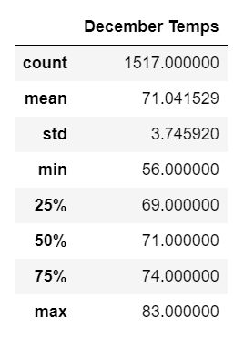

# Surfs Up

## Project Overview 
A Surf n’ Shake shop serving surfboards and ice cream to locals, tourists. Shop requires some real investor backing to get off the ground. A strong business plan was put together in front of investor W. Avy who is famous for his love of surfing. W. Avy is willing to invest but he has one concern. What about the weather? He is extremely serious about this. He invested in a surf shop early in his career. However, he did not ask for any weather analysis and that early venture was rained out of existence. W. Avy has an SQLite weather dataset for Oahu where Surf n’ Shake shop will be opened. The propose of this project is to run analytics on a weather dataset provided by W. Avy. Specifically, he wants temperature data for June and December in Oahu, to determine if the surf and ice cream shop business is sustainable year-round.

## Results
Here are the three key differences in weather between June and December(See Images):   
- The mean temperature for June is 75°F and for December is 71°F.
- Min temperature for June is 64°F and for December is 56°F.
- Max temperature for June is 85°F and for December is 83°F.

> |June Temps| December Temps|
> |-----|-----|
> || |

## Summary
June and December do not have an extreme temperature difference, so the surf and ice cream shop business should be sustainable year-round. Two additional queries that can be performed to gather more weather data for June and December are the following:
- Write a query to get the precipitation Data for the month of June and December.
- Write a query to group Tobs data by Station for the month of June and December.